# Projeto de Interface

## Diagrama de Fluxo

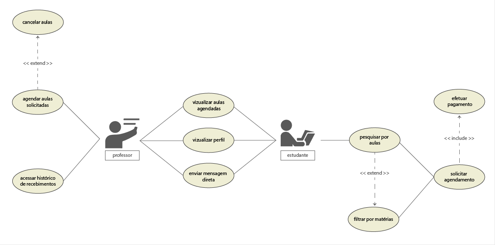

## Wireframes

Tela inicial com informações da plataforma e redirecionamentos para login e cadastro

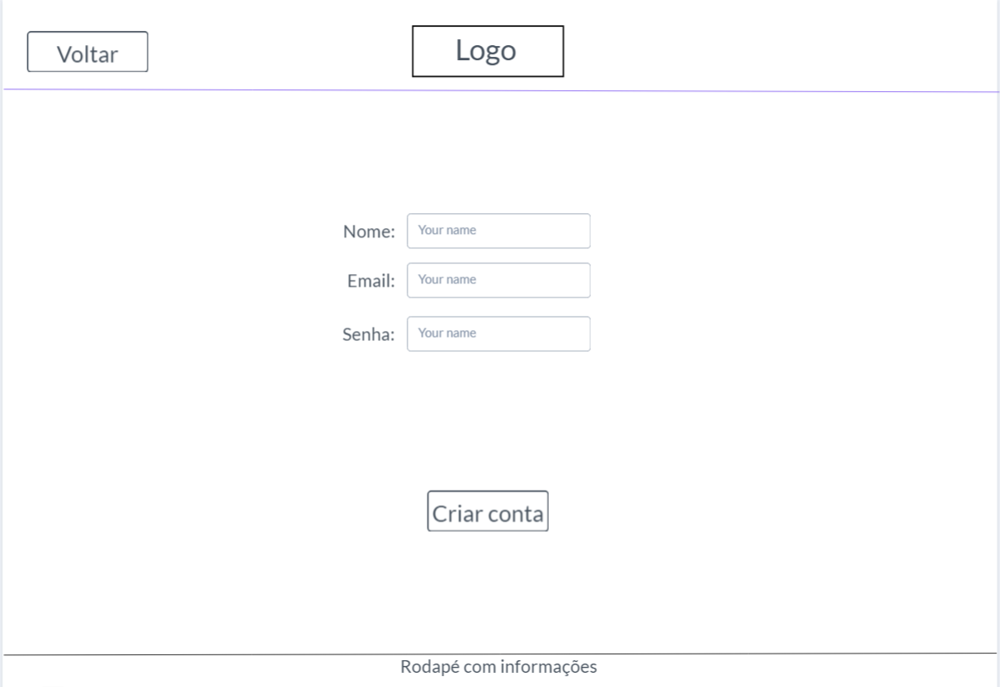

Tela de cadastro de alunos

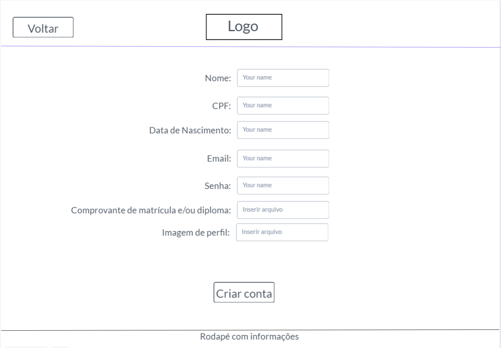

Tela de cadastro de professores

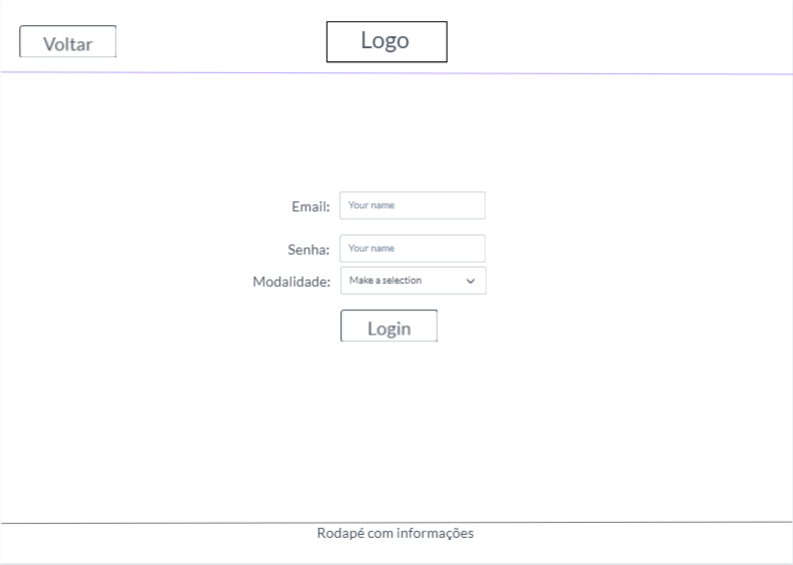

Tela de login para o portal de cada modalidade

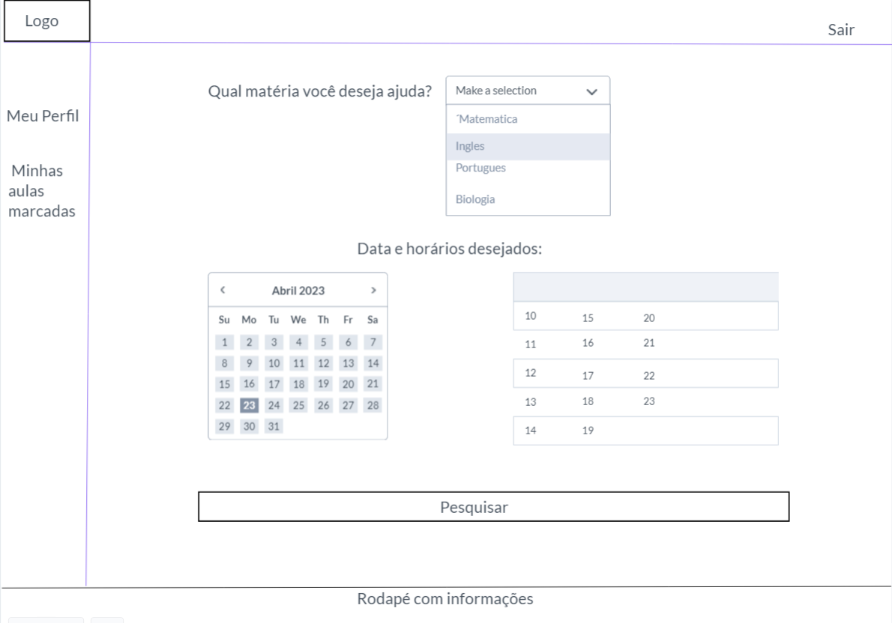

Tela inicial após login de alunos

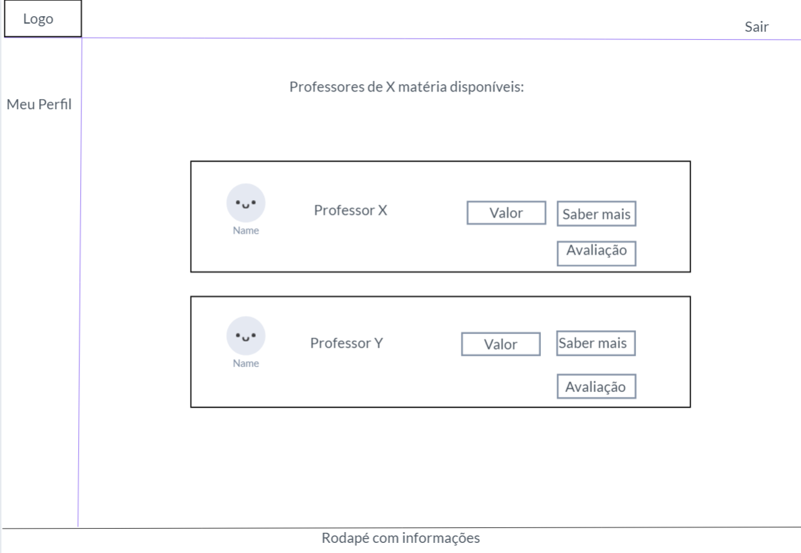

Tela após pesquisa que mostra professores disponíveis em tal matéria selecionada

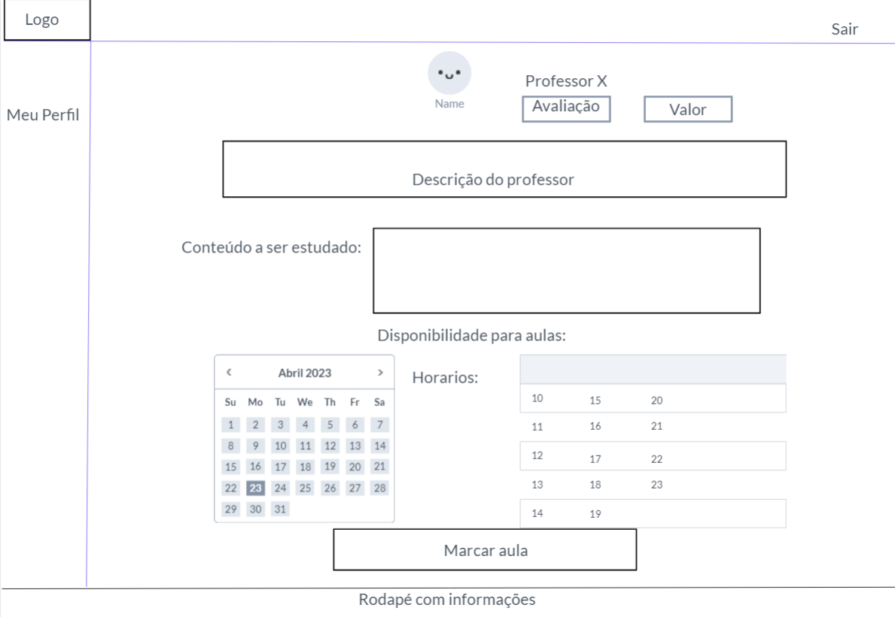

Tela para marcar uma aula com o professor selecionado

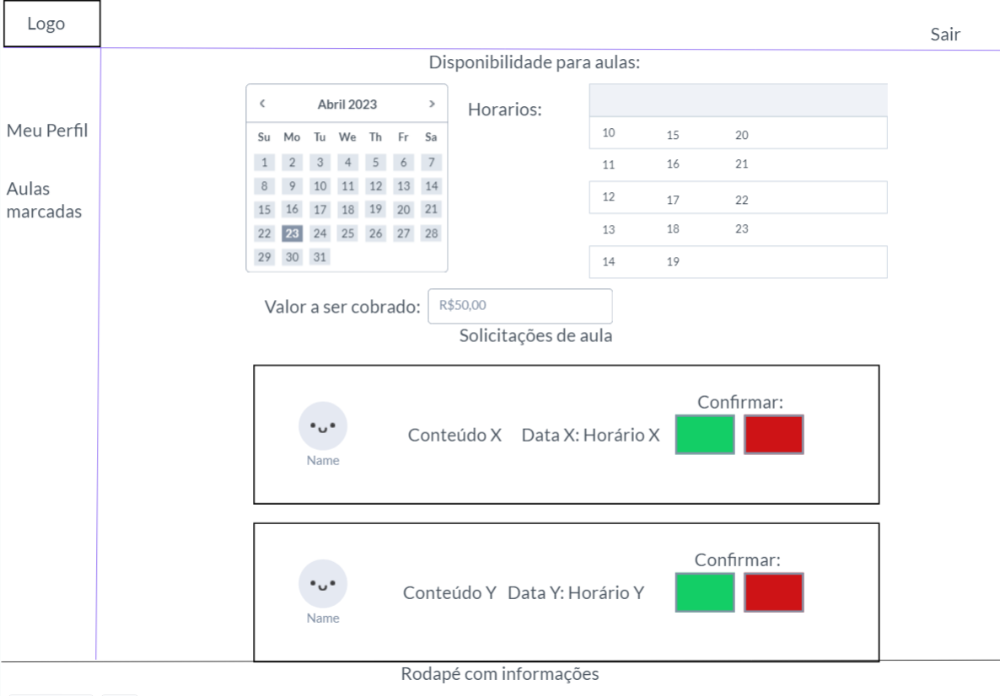

Tela inicial após login no perfil professor e aulas para serem confirmadas

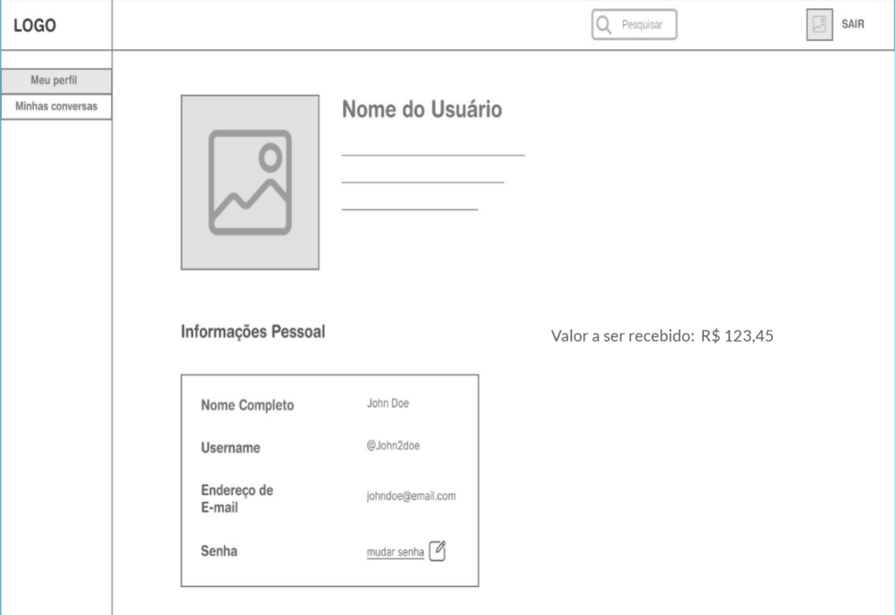

Tela de perfil com informações pessoais e valores a serem recebidos pelos professores

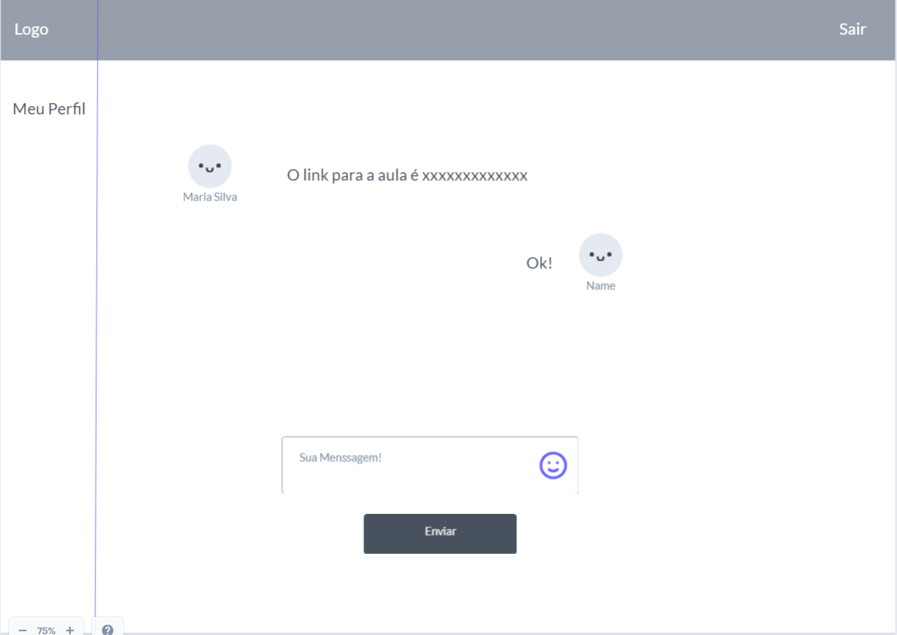

Tela de chat para troca de informações entre alunos e professores

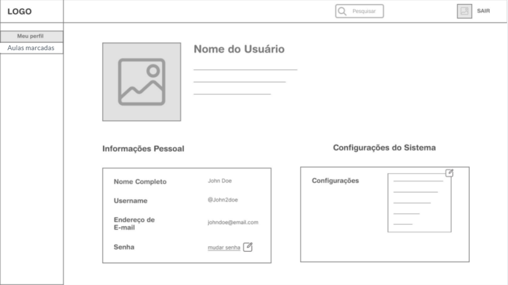

Tela de perfil de alunos
